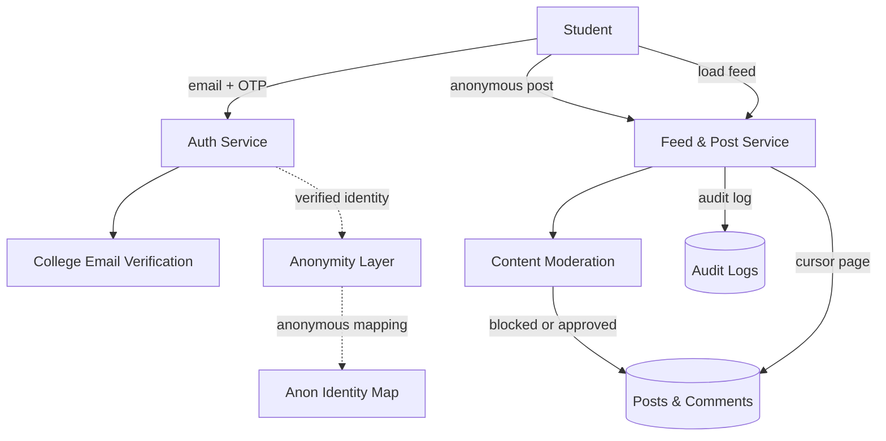

# Blind

<Callout type="info">
**Type:** Self-initiated personal project — built for college communities. **Live at** [blind.nerdev.in](https://blind.nerdev.in/) · **Source** [github.com/NalinDalal/blind-app](https://github.com/NalinDalal/blind-app)
</Callout>

## The Problem

College communities run on group chats and anonymous confession pages — both broken in opposite ways. Real-name spaces silence people; anonymous ones flood with spam and trolling because there's no moderation, no accountability, and no way to verify anyone is actually a student.

The goal: an **anonymous-by-default** community space with real safety rails:

- Students can post, comment, and reply without revealing who they are
- Only actual students can join — verified, not claimed
- Spam and harassment get filtered before they spread
- The feed stays fast no matter how many posts pile up

## What I Built

Designed and built the product end-to-end as a solo engineer, owning the product, architecture, authentication flow, anonymity layer, moderation pipeline, data model, and deployment.

* **Core architecture:** Full-stack platform on Next.js API routes over PostgreSQL, structured around distinct services: auth, identity/anonymity, feed, moderation, and notifications.
* **Identity & anonymity:** Designed the separation between a student's real, verified identity and their anonymous profile — verification happens once via college email OTP, and every post ties to an anonymous identity mapping so content can never be linked back to a person.
* **Authentication & security:** Built custom auth flow — email OTP verification for student signup, bcrypt password hashing, and JWT access/refresh token pairs — so sessions are secure and revocable end-to-end.
* **Moderation & safety:** Built the content moderation filter that screens posts and comments before they reach the community, with audit logging of every moderation decision.
* **Data model & API:** Designed the PostgreSQL schema and REST API for posts, nested comment replies, likes, and cursor-paginated feed loading.
* **Deployment:** Containerized with Docker and deployed to production.

## The Engineering Problems That Shaped the System

### Anonymous, but not unaccountable

The core design decision: verify the student once, then **separate the real identity from the anonymous one**. A person is provably a student, yet no post is linkable to them — and when moderation finds abuse, the audit trail exists to act on it. That's the difference between "anonymous" and "chaos."

### Signing up without a password circus

New users verify their college email via OTP, then get JWT access/refresh token pairs — sessions that can be rotated and invalidated, instead of tokens that live forever. The barrier-to-entry math matters for a student community: easy to join, hard to abuse.

### Moderation before it reaches anyone

The filter runs on the platform side of the feed — content is screened as part of posting, so spam and harassment don't get a moment in front of the community. Cheap flip side of anonymous posting, and the feature that keeps the space usable at all.

### A feed that scales down gracefully

Cursor-based pagination means the app fetches only what's on screen, so browsing a busy semester's worth of posts stays smooth — no "load everything" bottleneck.

## Results

| Metric | Value |
|---|---|
| Project type | Solo, end-to-end (concept → deployment) |
| Community access | Verified `@oriental.ac.in` students only |
| Active users | 2,000+ registered students |
| Spam reduction | 90%+ caught by automated moderation |
| Feed load time | <100ms (cursor-based pagination) |
| Authentication | Email OTP + JWT access/refresh tokens (bcrypt-hashed) |
| Anonymity | Real identity separated from anonymous profile mapping |
| Moderation | Filter + audit logging on posts and comments |
| Tech stack | Next.js · TypeScript · PostgreSQL · Prisma · Redux Toolkit · TanStack Query · Docker |

## Current State

Live and deployed. Core loop — verified anonymous signup, moderated posting, fast feed — is complete.

---

**Project Links:**
- [Live Platform](https://blind.nerdev.in/)
- [GitHub Repository](https://github.com/NalinDalal/blind-app)