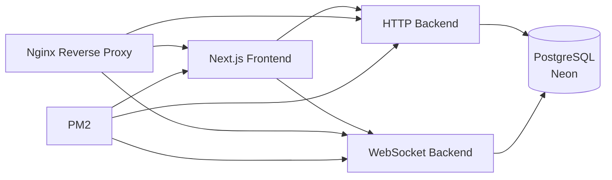
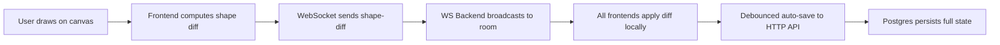
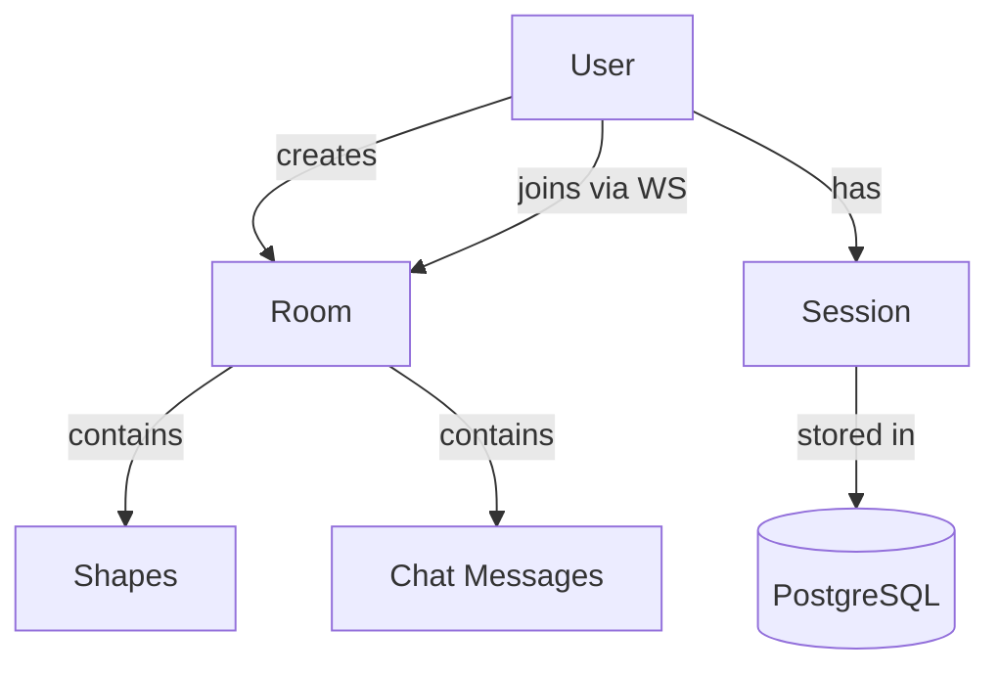

# CoDraw

<Callout type="info">
**Type:** Self-initiated personal project — a full-featured collaborative whiteboard. **Live at** [your-domain.com](https://your-domain.com) · **Source** [github.com/NalinDalal/week-22-excalidraw](https://github.com/NalinDalal/week-22-excalidraw)
</Callout>

## Problem / Context

CoDraw was built to fill a gap in the collaborative whiteboard space: most tools either sacrifice the hand-drawn aesthetic for performance, or lock you into a closed, cloud-only ecosystem. Existing open-source alternatives like Excalidraw are client-side only — no real-time sync, no auth, no persistence. I wanted a self-hostable whiteboard that kept the organic Rough.js drawing style, supported rich shape operations and real-time collaboration, and could run on modest infrastructure without depending on a vendor's servers.

The project started as an Excalidraw clone but evolved into a production-ready collaborative application with:

- real-time shape synchronization across multiple users in the same room
- a full drawing toolkit (pencil, shapes, text, images, eraser)
- undo/redo, grouping, copy/paste, and selection
- export to PNG, SVG, and JSON
- session-based authentication with token revocation
- optimistic concurrency for conflict-free concurrent editing
- automated deployment to a single EC2 instance

The project was built iteratively across multiple development sprints, with each phase adding a distinct architectural layer — from basic canvas rendering to WebSocket real-time sync, from client-side state management to server-side persistence with optimistic locking.

## My Role

I was responsible for the full-stack implementation across frontend, backends, data layer, and deployment infrastructure.

My work centered on:

- architecting a Turborepo monorepo with three independent services (frontend, HTTP API, WebSocket)
- implementing the canvas engine from scratch with Rough.js rendering and viewport transforms
- building the WebSocket real-time synchronization protocol with room-based broadcasting
- designing the Prisma schema for rooms, shapes, chat messages, and user sessions
- implementing session-based authentication with httpOnly cookies and token revocation
- adding optimistic concurrency control to prevent silent data loss during concurrent edits
- building the CI/CD pipeline with GitHub Actions for automated deployment to EC2
- hardening the system against common WebSocket, authentication, and data integrity failure modes

This was a solo full-stack effort with emphasis on realtime systems, frontend state management, and production deployment.

## Architecture Overview

**Architecture at a glance:**

The system runs as a Turborepo monorepo with three runtime services behind an Nginx reverse proxy, deployed to production on a single AWS EC2 instance:

- **`apps/frontend`** — Next.js 15 / React 19 (port 3000). Canvas rendering with Rough.js, local state management, WebSocket client, and auto-save.
- **`apps/http-backend`** — Bun + native Web API (port 3001). Auth, room CRUD, session management, shape persistence.
- **`apps/ws-backend`** — Bun + WebSocket server (port 8080). Real-time shape diff broadcasting, cursor sync, chat, and room management.
- **Nginx** routes `/api/*` to HTTP backend, `/ws` to WebSocket backend, everything else to the frontend.

In production, all three services run under **PM2** on a single EC2 instance (t3.small), with Neon providing managed PostgreSQL. CI/CD is a two-stage GitHub Actions pipeline: CI runs typecheck, lint, and build on every PR and push to main; on success, the deploy workflow SSHes into EC2, pulls latest code, rebuilds, runs migrations, and restarts PM2.

The data layer is shared across services via the `@repo/db` workspace package:

- **PostgreSQL (Neon)** — the sole system of record. The Prisma schema defines models for `User`, `Room`, `Chat`, `Session`, and shape-related tables. Sessions are server-side with httpOnly cookies for revocation support.
- **PM2** — process manager keeping all three services alive with automatic restarts on failure.

## The Journey: From Canvas to Collaborative Platform

The architecture evolved through distinct phases, each driven by a concrete limitation in the previous approach.

### Phase 1 — Canvas Foundation (Jan 2025)

Basic Next.js app with Rough.js rendering, pencil drawing, and zoom/pan. The canvas engine was built from scratch with a custom viewport transform system and dirty-rect rendering optimization. At this stage, everything was client-side — no persistence, no collaboration, no backend.

### Phase 2 — Backend & Auth (Jul 2025)

Added the HTTP backend with Bun, bcrypt password hashing, JWT authentication, and room management. The Prisma schema was introduced with `User`, `Room`, and `Chat` models. This phase established the monorepo structure with shared packages.

### Phase 3 — Real-Time Collaboration (Jul 2025)

The WebSocket backend was added to handle real-time shape synchronization. The protocol was designed around diff-based updates: clients send shape changes (not full state), and the server broadcasts only the delta to other room members. This minimized bandwidth and kept the UI responsive.

### Phase 4 — Production Hardening (Aug 2026)

Security audit, crash fixes, Bun migration, session management overhaul, and CI/CD setup. Key changes included moving from stateless JWTs to server-side sessions with httpOnly cookies, adding optimistic concurrency with version checking, implementing auto-reconnect with exponential backoff, and hardening against common attack vectors (XSS, CORS misconfiguration, rate limiting).

## Domain Model & Core Concepts

### Room-Based Collaboration

The fundamental unit of collaboration is the **Room**. Each room has:

- A unique slug for navigation
- An owner (the user who created it)
- A set of active WebSocket connections
- A shape state that is the source of truth for the canvas

Users authenticate via the HTTP API, receive a session cookie, then connect to the WebSocket server with a short-lived WS token. The WS server validates the session before allowing `join_room`.

### Core Data Model (Prisma)

| Model | Purpose |
|---|---|
| `User` | Authentication and profile |
| `Room` | Collaborative workspace with slug-based access |
| `Chat` | Messages within a room |
| `Session` | Server-side session storage with expiration |
| Shape tables | Persisted shape state for auto-save |

## Hard Technical Challenges Solved

### 1. Real-time shape synchronization without full-state broadcasts

The naive approach — broadcast the entire shape array on every change — doesn't scale. With 10+ users in a room making frequent edits, bandwidth and processing costs grow quadratically.

**Solution: diff-based protocol with authoritative server state.**

When a user modifies a shape, the frontend computes a minimal diff (added, modified, deleted shape IDs) and sends only that over WebSocket. The WS backend broadcasts the diff to all other room members, who apply it to their local state immediately. Persistence is handled separately: the frontend debounces saves (every few seconds) and sends the full state to the HTTP backend, which writes to Postgres with optimistic concurrency control.

On reconnection, the server sends the full authoritative state, and the client replaces its local state. No delta replay needed.

**Optimistic concurrency.** Each save includes a version number. If the server's version doesn't match what the client based its edit on, it returns 409 Conflict. The frontend then fetches the latest state and merges. This prevents silent data loss when two users edit the same shape simultaneously.

### 2. Session management with token revocation

Stateless JWTs can't be revoked before expiry — a security risk if a user logs out or an admin needs to invalidate a session.

**Solution: server-side sessions with httpOnly cookies.**

The Prisma `Session` model stores token hashes with expiration timestamps. On signin, the backend creates a session record and issues two tokens:

- A 5-minute WebSocket token as an httpOnly, Secure, SameSite=Strict cookie — not readable from JavaScript, not exposed to XSS
- A short-lived access token returned in the response body for the client to hold in memory for HTTP API calls

The WebSocket auth flow works around a constraint: WebSocket upgrade handshakes don't support custom headers in all browsers. Instead, the frontend calls `/auth/ws-token` to get a fresh WS token, then passes it in the WebSocket query string. The WS backend verifies the session exists in Postgres before accepting the connection.

A heartbeat timer refreshes the WS token every 4 minutes, and `re_auth` messages allow the server to update the connection's user ID without dropping the socket. Logout hits `/auth/logout`, revokes the session, and clears the cookie.

### 3. Making the hand-drawn aesthetic performant

Rough.js renders shapes with a hand-drawn, sketchy aesthetic — but it's CPU-intensive, especially at 60fps during drawing.

**Solution: dirty-rect rendering and layer caching.**

The canvas only redraws shapes that intersect the changed region (dirty rect), not the entire canvas. Shapes are grouped into layers (static, active, overlay), and only the active layer redraws during interaction. On zoom changes, stroke width scales proportionally to maintain visual consistency. This keeps the canvas responsive even with hundreds of shapes.

### 4. Auto-save with conflict resolution

Frequent auto-saves can conflict with WebSocket-driven remote changes. Saving the full state on every keystroke would overwrite remote users' work.

**Solution: debounced persistence with version checking.**

The frontend debounces saves (default 1.5s) and sends the full shape state with the last-known version. The server compares against the current version in Postgres. If they match, it increments the version and saves. If not (someone else saved in between), it returns 409 with the current state. The frontend then merges: it takes the remote state, reapplies any local changes that don't conflict, and retries the save. Local changes win on shape-level conflicts, preserving the user's intent.

### 5. WebSocket reconnection with full state reconciliation

WebSocket connections drop — network blips, server restarts, laptop sleep, tab switches. A naive reconnect either loses messages or requires complex delta replay.

**Solution: authoritative server state with reconnect reconciliation.**

The frontend maintains local state as the source of truth for the UI, so the canvas stays fully interactive while disconnected — users can still draw, select, and edit shapes. The WebSocket client auto-reconnects with exponential backoff (1s initial, 30s max, jitter). On successful reconnection, the server sends the current authoritative shape state for that room, and the client replaces its local state entirely.

A heartbeat timer (every 4 minutes) fetches a fresh WebSocket token and sends a `re_auth` message, so sessions don't expire mid-session without dropping the socket. If the heartbeat fails (auth error, network), the client disconnects and triggers the reconnect flow.

This design means there's no delta replay logic, no message sequence numbers to track, and no risk of applying stale diffs to a state that changed significantly while offline. The trade-off is a visible "jump" when state syncs after a long disconnect — acceptable for a whiteboard where exact pixel-perfect continuity isn't required.

## Reliability & Deployment

### Observability

- **Error boundaries** catch render errors in the canvas tree and display fallback UI instead of crashing the whole app
- **WebSocket reconnection** with exponential backoff (initial 1s, max 30s) — the canvas stays interactive while disconnected
- **Graceful shutdown** on SIGTERM/SIGINT — active WebSocket connections are closed cleanly, not dropped
- **Body size limits** on HTTP endpoints to prevent memory exhaustion from large payloads
- **Message size limits** on WebSocket messages to prevent DoS
- **Rate limiting** on auth endpoints (sliding window, in-memory)

### CI/CD

GitHub Actions workflows run on every PR and push to main:

1. **CI** — install, lint, typecheck, build across all workspaces via Turborepo
2. **Deploy** — triggered only on CI success: SSH into EC2, `git reset --hard`, `bun install --frozen-lockfile`, `bun run build`, `prisma migrate deploy`, `pm2 restart all --update-env`

The deploy is idempotent: `pm2 start ecosystem.config.js --update-env` replaces the existing process without manual intervention.

### Incident Response

Two production incidents have been documented in the repository:

**Incident 1: Nginx `/api/` prefix not stripping (2026-08-08)**

Every API call returned 404. The root cause was Nginx's `proxy_pass` not including a trailing slash, so `/api/rooms` was forwarded to `localhost:3001/api/rooms` instead of `localhost:3001/rooms`. Fixed by updating the Nginx config to strip the prefix.

**Incident 2: Nginx upstream IP staleness after container recreation (2026-08-11)**

After deploys that recreated Docker containers, Nginx continued proxying to old upstream IPs, returning 502. The root cause was Nginx resolving upstream hostnames once at startup and caching them. Fixed by configuring Nginx to re-resolve DNS on each request using Docker's embedded DNS resolver (`127.0.0.11`) with a 30s TTL, so recreated containers are automatically picked up without restarting Nginx.

## Results & Metrics

| Metric | Value |
|---|---|
| Development period | Jan 2025 → present (production since Aug 2026) |
| Commits | 400+ |
| Lines of code | ~15,000+ (excluding node_modules) |
| Drawing tools | 10 (Select, Pencil, Rectangle, Ellipse, Diamond, Arrow, Line, Text, Image, Eraser) |
| Export formats | 3 (PNG, SVG, JSON) |
| WebSocket message types | 6 (shape-diff, cursor, chat, join_room, leave_room, re_auth) |
| Session duration | 5 min WS token, 7 day refresh token |
| Auto-save debounce | 1.5s |
| Undo stack cap | 100 entries |
| Reconnect backoff | Exponential, 1s initial, 30s max |
| Production deployment | AWS EC2 t3.small + Nginx + PM2 + Neon Postgres |

## Tech Stack

- TypeScript
- Bun
- Next.js 15
- React 19
- Tailwind CSS
- Rough.js
- Prisma ORM
- PostgreSQL (Neon)
- WebSocket (Bun native)
- Nginx
- PM2
- GitHub Actions
- AWS EC2
- Turborepo

## Current State

The project is live and production-ready. The repository includes:

- a fully functional canvas engine with 10 drawing tools
- real-time multi-user collaboration over WebSocket
- session-based authentication with token revocation
- optimistic concurrency for conflict-free concurrent editing
- export to PNG, SVG, and JSON
- dark/light theme with persistence
- touch support (pinch-to-zoom, two-finger pan)
- keyboard shortcuts for all major actions
- automated CI/CD deployment to EC2
- incident documentation and operational runbooks

Areas still evolving include test coverage (currently manual verification), a notification preference system (not yet needed for a whiteboard), and deeper accessibility audit on the canvas controls. The core product is stable, deployed, and functional.

## What I Built

- Built a real-time collaborative whiteboard from scratch, including a custom canvas engine with Rough.js rendering, viewport transforms, and dirty-rect optimization.
- Architected a Turborepo monorepo with three independent services: Next.js frontend, Bun HTTP backend, and Bun WebSocket backend, orchestrated by Nginx and PM2.
- Implemented the WebSocket real-time synchronization protocol with diff-based broadcasting, room management, cursor sync, and exponential-backoff reconnection with full state reconciliation.
- Designed the Prisma schema and implemented session-based authentication with httpOnly cookies, server-side session storage, token revocation, and proactive WebSocket token refresh.
- Added optimistic concurrency control with version checking to prevent silent data loss during concurrent shape edits, with 409 conflict handling and client-side merge.
- Built auto-save with debounced persistence, undo/redo with delta-based stacks, shape grouping, copy/paste, and export to PNG/SVG/JSON.
- Set up GitHub Actions CI/CD with typecheck, lint, and build on every PR, and automated deploy to EC2 with health checks and idempotent PM2 restarts.
- Hardened the system against common failure modes: JSON.parse crashes, race conditions, division by zero, stack overflow on large arrays, memory leaks, and CORS misconfiguration.

## What This Project Demonstrates

This case study highlights engineering decisions that matter in interviews for frontend and full-stack roles:

- realtime state synchronization protocols (diff-based broadcast, authoritative server state, reconnect reconciliation)
- frontend state management at scale (local state, WebSocket integration, debounced persistence, conflict resolution)
- service boundaries and modularity (separate WS and HTTP services, shared packages in a monorepo)
- production deployment patterns (PM2, Nginx, CI/CD, incident response)
- practical tradeoffs in a real product (last-write-wins vs CRDTs, debounce timing, session vs JWT)
- security hardening (httpOnly cookies, CORS restriction, rate limiting, input validation)
