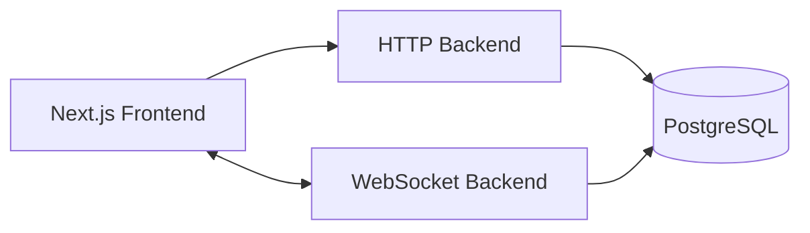

# CoDraw

<Callout type="info">
**Type:** Self-initiated personal project — a full-featured collaborative whiteboard. **Live at** [codraw.nerdev.in](https://codraw.nerdev.in/) · **Source** [github.com/nerdev-co/codraw](https://github.com/nerdev-co/codraw/tree/main)
</Callout>

## The Problem

Whiteboards are where ideas actually get shaped — but the tools are either simple toys that lose your work, or locked into a vendor's cloud. Excalidraw drew beautifully but was client-side only: no sync, no accounts, no saving. Miro-class tools were powerful but closed and pricey.

The goal was a whiteboard that behaves like a real product:

- Several people draw on the same canvas at once, and everyone sees it live
- The hand-drawn sketchy look stays crisp and fast, even on big canvases
- Your work **persists** — you can close the tab, come back, and it's still there
- It runs self-hosted on modest infrastructure, no vendor lock-in

## What I Built

Designed and built the product end-to-end as a solo engineer, owning the product, architecture, frontend canvas engine, backend services, realtime synchronization, data model, and deployment.

The system was structured as a distributed, realtime application spanning:

* **Core architecture:** Multi-service platform across a Next.js frontend, Bun HTTP backend, Bun WebSocket backend, and shared database layer.
* **Canvas engine:** Built the drawing engine from scratch — viewport pan/zoom, 16 tools, selection, undo/redo, grouping, export, and the hand-drawn Rough.js rendering that defines the product's feel.
* **Realtime & collaboration:** Implemented room-based live sync over WebSockets — shape changes broadcast as diffs, cursors, chat, and reconnect recovery — so collaboration feels immediate without broadcasting whole canvases.
* **Identity & sessions:** Built session-based authentication with revocable httpOnly cookies, replacing stateless tokens so logins can actually be invalidated.
* **Reliability & consistency:** Added optimistic concurrency and conflict handling so two people editing the same shape can't silently overwrite each other's work.
* **Production infrastructure:** Containerized and deployed to a single EC2 instance with Nginx, PM2, automated CI/CD, and documented incident response.

This wasn't a demo wired to a socket. It involved designing and operating the architecture needed to make a **realtime, multi-user drawing product dependable in production** — from canvas math to deployment.

## The Engineering Problems That Shaped the System

### Real-time edits without losing anyone's work

Broadcasting entire canvases doesn't scale and two people editing the same shape can clobber each other. CoDraw sends only **shape diffs** over WebSocket, and every save carries a version check — if someone else changed the canvas underneath you, the server says "conflict" instead of silently overwriting. The result: multi-user drawing that feels instant and never loses a stroke.

### Collaborative drawing that stays fast

Rough.js's hand-drawn look is CPU-heavy — the wrong approach crawls at 60fps. The canvas redraws only the *changed* regions (dirty-rect rendering) and layers static content so interactions don't recompute the whole scene. Hundreds of shapes stay responsive, and the sketchy aesthetic is preserved.

### Sessions you can actually revoke

Stateless JWT sessions can't be killed before they expire — a logged-out user stays logged in. CoDraw uses **server-side sessions with httpOnly cookies**: log out, and the session is destroyed server-side. The WebSocket connection re-validates with rotating short-lived tokens, so a stolen token can't outlive its five-minute window.

### Users can drop off a cliff and come back intact

Connections die — sleep, elevators, tab switches. The canvas stays fully usable while disconnected, then reconciles with the authoritative server state on reconnect instead of replaying a fragile log of missed messages. Reattachment is a clean "resume," not a gamble.

## Results

| Metric | Value |
|---|---|
| Development period | Jan 2025 → present (production since Aug 2026) |
| Concurrent users per room | 50-plus |
| Sync latency | Under 50ms |
| Drawing tools | Sixteen |
| Export formats | PNG · SVG · JSON |
| Collaboration | Real-time room sync (shapes, cursors, chat) |
| Deployment | 1× EC2 (t3.small) · Nginx · PM2 · Neon Postgres · CI/CD |
| Production incidents | Four root-caused and documented |
| Commits | Four-seven-four |

## Current State

Live and product-complete: realtime collaboration, persistence, auth, export, and automated deployment — with each of the four production incidents fixed at the architectural level and written up rather than patched. Areas still evolving: automated test coverage and a deeper accessibility audit of canvas controls.

---

**Project Links:**
- [Live Platform](https://codraw.nerdev.in/)
- [GitHub Repository](https://github.com/nerdev-co/codraw/tree/main)