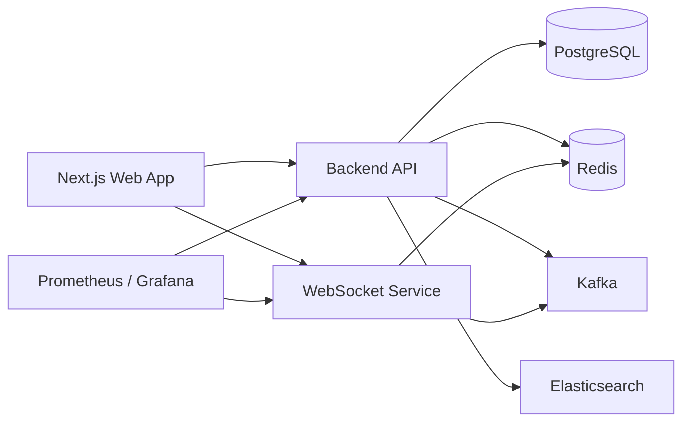
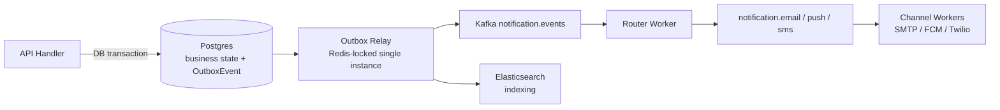
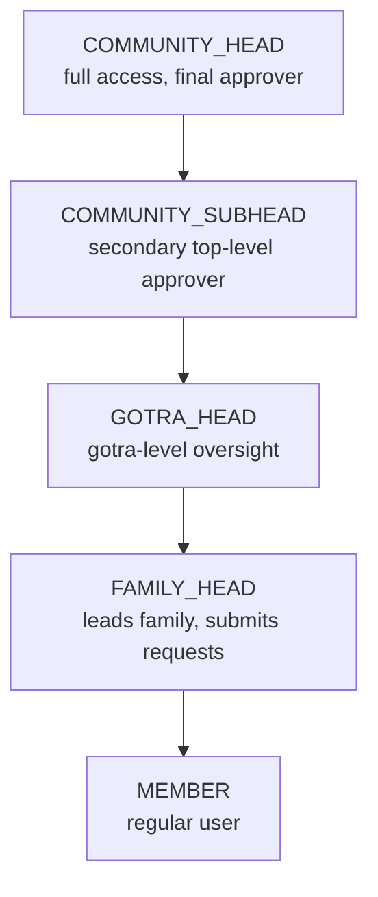
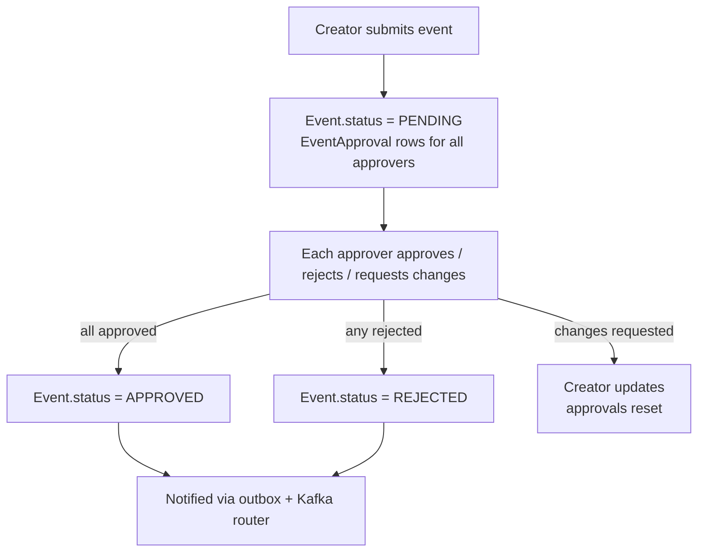
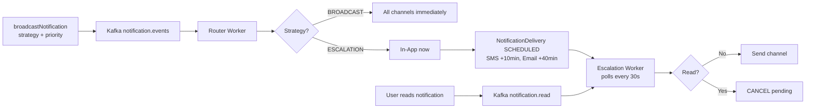

# Modheshwari

<Callout type="info">
**Type:** Self-initiated personal project — built for the Modheshwari community. **Live at** [modheshwari.nerdev.in](https://modheshwari.nerdev.in/) · **Source** [github.com/nerdev-co/modheshwari](https://github.com/nerdev-co/modheshwari)
</Callout>

## Problem / Context

Modheshwari was built to solve a practical coordination problem for a community organization: how to manage families, governance roles, events, approvals, communications, and member discovery without relying on scattered spreadsheets, group chats, and manual follow-ups.

The platform is designed for a community of **10,000-15,000 members** and needed to support a mix of high-trust administrative workflows and day-to-day member interaction. In practice, that meant a system that could:

- model community hierarchy and role-based permissions
- support event approvals and registrations
- handle resource requests with multi-step review
- deliver notifications and chat in near real time
- remain operational in a self-hosted or small-team deployment environment

The project was never just a CRUD app. It was a distributed product with business rules, notification delivery, realtime communication, and infrastructure concerns all interwoven — and it evolved through five architectural phases over roughly four months of development.

## My Role

I was responsible for shaping and implementing the core product architecture across the backend, realtime messaging layer, data model, and deployment structure.

My work centered on:

- designing the multi-service architecture for API, websocket, and background processing
- implementing the domain model and workflows for families, events, approvals, and notifications
- building authentication and role-based authorization for different community roles
- integrating asynchronous notification delivery with Kafka and Redis
- hardening the system: transactional outbox, consumer idempotency, reconnect reconciliation, audit logging
- setting up containerized deployment, observability, and operational tooling

This was a full-stack implementation with strong backend and platform responsibilities rather than a UI-only exercise.

## Architecture Overview

**Architecture at a glance:**

The system runs as a monorepo with three runtime services behind an Nginx reverse proxy:

- **`apps/be`** — Bun + Elysia REST API (port 3001). All business logic, RBAC, and Prisma access.
- **`apps/ws`** — Bun + `ws` WebSocket server (port 3002). Realtime chat and notification delivery.
- **`apps/web`** — Next.js 15 frontend (port 3000).
- Nginx routes `/api/` to `be:3001`, everything else to `web:3000`, and WebSocket upgrades to `ws:3002`.

The data layer is shared across services:

- **PostgreSQL (Neon in production)** — the sole system of record. Families, members, events, approvals, notifications, messages, outbox events, and audit logs.
- **Redis** — caching, Pub/Sub fan-out for WebSockets, rate limiting, DLQ, notification drain, Kafka consumer idempotency, and the outbox relay lock.
- **Kafka** — the async notification backbone with 5 topics: `notification.events`, `notification.email`, `notification.push`, `notification.sms`, `notification.read`.
- **Elasticsearch** — a derived search index (users + events), kept in sync via the outbox relay plus a periodic reconciliation worker.

## The Journey: From REST to Event-Driven

The architecture didn't start here — it evolved through five phases, each driven by a real limitation in the previous one.

### Phase 1 — REST API Foundation (Oct - Nov 2025)

A traditional synchronous Bun + Elysia API with JWT auth, RBAC (5 roles), and REST endpoints for families, users, profiles, search, events, and resource requests. Rate limiting (5 login/signup, 30 search per minute) and pagination were added early — they proved essential in production. The obvious gap: no realtime communication.

### Phase 2 — WebSocket Real-Time Layer (Jan 2026)

A separate WebSocket server (`apps/ws/`) for direct messaging — conversations API, typing indicators, read receipts, optimistic UI. **Key decision: separate process**, so chat failures never cascade into the API and connections can scale independently.

### Phase 3 — Kafka Event-Driven Architecture (Jan 2026)

Synchronous notification delivery blocked API responses. Kafka decoupled it: the API publishes to `notification.events` and returns in under 10ms while workers process asynchronously. Topic-based routing allowed channel-specific workers to be added without touching the producer.

### Phase 4 — Multi-Channel Notification Workers (Jan - Feb 2026)

Production-ready workers for all four channels, each isolated with its own Kafka topic:

- **Router worker** — per-recipient routing, respects user preferences, handles priority
- **Email worker** — Nodemailer SMTP (Gmail / SendGrid / AWS SES), HTML templates, retry with backoff
- **Push worker** — Firebase Cloud Messaging, device token management, 150-char limit
- **SMS worker** — Twilio, phone validation, 160-char formatting

SDKs are loaded lazily and optional — if Firebase or Twilio credentials are missing, workers degrade gracefully instead of failing the pipeline.

### Phase 5 — Hybrid Delivery with Escalation (Feb 2, 2026)

Progressive delivery to optimize cost and UX: in-app first, escalate to SMS after 10 minutes and email after 40 minutes if still unread. More on this below.

## Domain Model & Roles

### Role-Based Access Control

Five levels of RBAC enforced via a `requireAuth(req, allowedRoles?)` middleware gate on every protected route. Approvals flow upward (Family Head → Gotra Head → Subhead → Community Head). Role changes are checked by `checkRoleChangePermission()` and written to an immutable audit table (see Reliability).

### Core Data Model (Prisma, 30+ models)

| Model | Purpose |
|---|---|
| `User`, `Profile` | Members, one-to-one profile with phone/gotra/location/status |
| `Family`, `FamilyMember` | Families with readable `uniqueId`; membership history preserved via junction records |
| `MemberInvite` | Pending join requests (PENDING/APPROVED/REJECTED) — family head approves before membership is created |
| `UserRelation` | Directed lineage relations (SPOUSE/PARENT/CHILD/SIBLING) with unique constraint against duplicates |
| `Event`, `EventApproval`, `EventRegistration`, `Payment` | Event lifecycle with per-approver records, cascading deletes from the FK side |
| `ResourceRequest` | Multi-step review with cached `approverName` snapshot |
| `Notification`, `NotificationDelivery` | Per-channel delivery records with status tracking |
| `Conversation`, `Message` | Chat, persisted before fan-out |
| `OutboxEvent`, `OutboxEventDeadLetter` | Transactional outbox + dead-letter queue |
| `RoleChangeAudit` | Immutable audit log for role changes |

Two design decisions here are worth calling out:

- **`approverName` is a cached snapshot** on approval records — avoids a join in hot list views.
- **Cascade deletes live on the FK side** (`onDelete: Cascade` on `EventApproval.event`), which is Prisma-compatible; `User` and `Family` intentionally have no cascades — soft deletes preserve history.

## Hard Technical Challenges Solved

### 1. Making notifications reliable without coupling delivery to the request path

The naive approach — save to DB, then publish to Kafka — has a fatal gap: if the process crashes between COMMIT and publish, the event is silently lost. That's the classic dual-write problem.

**Solution: transactional outbox.**

Every business mutation now commits inside a single Postgres transaction alongside an `OutboxEvent` row. A single outbox relay worker (locked via a Redis key so only one instance runs) polls pending events, publishes them to Kafka or Elasticsearch, and marks them published:

- Business write + outbox event commit atomically — rollback removes both
- The relay never holds a DB connection while waiting on Kafka — it claims events, releases, publishes, then updates
- Failures increment `attempts` and retry with backoff up to `OUTBOX_MAX_ATTEMPTS` (default 10), then move to `OutboxEventDeadLetter` with the failure reason
- The API returns **202 Accepted** immediately; the relay handles delivery

**Consumer idempotency.** Each outbox-produced Kafka message carries a stable `_outboxId` key. Consumers call `ensureIdempotent(messageKey)` before processing — a Redis SET with a 24h TTL makes duplicate deliveries (rebalance, replay, retry) silent no-ops. Idempotency does not rely on timestamps.

### 2. Moving from a basic CRUD app to a real workflow-driven system

The biggest architectural shift was moving away from treating the product as a set of simple create/read/update/delete screens and toward modeling real business processes. Early on, the project could have stayed as a collection of basic forms and tables, but the domain required stateful workflows, role-aware permissions, and multi-step coordination.

That meant changing how the system was designed:

- moving from isolated endpoints to a more intentional service and route structure
- introducing approval state machines for events and resource requests
- modeling relationships between users, families, and community roles instead of only storing flat records
- treating notifications and background processing as first-class concerns rather than afterthoughts

### 3. Implementing multi-step approvals for community workflows

Community workflows are not simple CRUD operations. Approvals are stateful, role-sensitive, and need to be evaluated across multiple actors.

This required carefully modeling the approval lifecycle in Prisma — `@@unique([eventId, approverId])` guarantees a single approval record per approver per event — and coordinating state transitions across related tables so the workflow stays consistent even as different actors review it concurrently.

### 4. Building a cost-aware notification delivery strategy (escalation)

Broadcasting every notification to every channel is expensive: SMS costs $0.01-0.05 per message, email ~$0.001, and 70% of users read in-app notifications within 5 minutes.

**Two delivery strategies:**

- **BROADCAST** — all enabled channels fire immediately. Used for critical/urgent content (payment confirmations, security alerts).
- **ESCALATION** — in-app first; if unread after 10 minutes → SMS; if still unread after 40 minutes → email. Used for informational content by default.

The escalation worker is database-backed polling (every 30s) rather than a distributed scheduler — simpler, survives worker restarts, and 30-second precision is irrelevant for 10-minute delays. Reading a notification publishes a `notification.read` event that the escalation worker consumes to cancel all pending deliveries for that notification.

**Priority overrides strategy:** `CRITICAL` priority forces BROADCAST even when ESCALATION was requested — guaranteed immediacy for the messages that matter.

### 5. Making realtime chat reliable in a multi-service deployment

The WebSocket layer is a separate service and had to work independently of the HTTP API — and, more importantly, survive failures.

**Message durability.** Chat messages are persisted to Postgres *before* Redis Pub/Sub fan-out. If the WS server restarts, Redis drops, or a client disconnects, nothing is lost.

**Reconnect reconciliation.** On connect, the server pushes unread notifications (`reconcileMissedNotifications`, up to 500). Clients can also send a `sync` message with `lastSeenAt`, `limit` (default 200, max 500), and `cursor` to recover missed chat messages paginated — the response includes `hasMore` and `nextCursor`. Clients deduplicate by `messageId`.

**Auth handshake hardening.** The server accepts unauthenticated upgrades but requires an initial `{type: 'auth', token: '<JWT>'}` handshake within 5 seconds. This removed a permissive `?token=` query-parameter path — tokens never leak into URLs while remaining browser-compatible. Heartbeat every 30s, timeout after 60s.

### 6. Absorbing fan-out write spikes with Redis caching

Large fan-outs (broadcast to an entire gotra) created spike writes to the primary DB. An optional caching mode (`NOTIFICATION_CACHE=true`) makes the fan-out worker write per-user notifications into Redis lists keyed `notifications:{userId}` with a configurable TTL (default 7 days) instead of doing immediate `createMany`. The Kafka routing event is still emitted, so channel workers keep working, and audit records stay updated. This absorbs short-lived write spikes, reduces DB contention, and improves fan-out latency.

### 7. Hardening: the production audit

An engineering audit of the codebase found four critical reliability gaps — non-atomic DB+Kafka writes, non-idempotent consumers, unpersisted WS messages, and fire-and-forget ES indexing — plus missing audit for role changes. All were fixed without breaking a single API contract (details in challenge 1 and 5). Beyond that:

- **ES indexing now goes through the outbox relay** — ES downtime never blocks DB writes, and failed indexing retries automatically. A periodic `esReconciliation` worker (every hour by default) re-indexes recently updated users/events to repair drift.
- **Role changes are audited.** Every change writes an immutable `RoleChangeAudit` record with actor, target, previous/new role, and metadata. Anomaly counters track role changes per hour per actor (threshold 5) and mass demotions per hour per actor (threshold 3), exposed as Prometheus metrics for alerting.
- **HTML sanitization** on email content (XSS), singleton PrismaClient to fix connection-pool exhaustion (10-15x throughput), proper SMS 160-char enforcement, SIGTERM handling on the escalation worker for container-safe shutdown, and lazy producer initialization on read endpoints.

## Reliability & Observability

Postgres is the system of record; every side effect flows through the outbox. The whole reliability layer is observable:

- **Metrics on `/metrics`**: `outboxPendingEvents`, `outboxPublishFailures`, `outboxRetryCount`, `websocketReconciliationCount`, `elasticsearchIndexFailures`, `roleChangeAnomalyCount`, plus consumer lag and per-channel success/retry/error rates
- **Prometheus / Grafana** dashboards for the API and WebSocket services, with Alertmanager for alerts
- **Dead-letter queues** for both outbox events and notification deliveries — no automatic replay UI yet, but every failed event is inspectable

## Results & Metrics

| Metric | Value |
|---|---|
| Development period | Oct 2025 → Feb 2026 (ongoing maintenance) |
| Commits | 146+ |
| Lines of code | ~15,000+ (excluding node_modules) |
| API endpoints | 50+ |
| Database models | 30+ |
| Notification channels | 4 (Email, SMS, Push, In-App) |
| Workers | 5 (Router, Email, Push, SMS, Escalation) + outbox relay + ES reconciliation |
| Kafka topics | 5 |
| Notification enqueue latency | Under 10ms (202 Accepted, async delivery) |
| Escalation savings | 70% of users read in-app within 5 minutes |
| RBAC levels | 5 |
| WebSocket reconnect recovery | Up to 500 missed notifications, paginated chat sync |

## Tech Stack

- TypeScript
- Bun
- Next.js 15
- React 19
- Tailwind CSS
- Elysia
- Prisma ORM
- PostgreSQL (Neon)
- Redis
- Kafka
- WebSocket service (Bun + ws)
- Elasticsearch
- Nginx
- Docker Compose
- GitHub Actions
- AWS ECR / ECS
- Prometheus / Grafana
- New Relic
- Terraform

## Current State

The project is live and in a portfolio-ready state. The repository includes:

- a working multi-service architecture (API, WebSocket service, background workers)
- a substantial Prisma domain model spanning families, events, approvals, notifications, messaging, and audit
- role-based CRUD and approval workflow logic
- realtime notification/chat capability with reconnect reconciliation
- a transactional outbox, consumer idempotency, and dead-letter handling
- deployment and monitoring configuration

It's a production-minded system with real architectural depth and operational concerns — the kind of project that holds up under the questions interviewers actually ask when they want to understand how someone thinks about systems, not just features. As with any actively maintained platform, some areas (test coverage, an outbox replay UI, notification preferences UI) are still evolving.

## What I Built

- Architected a full-stack community management platform designed to support 10,000-15,000 members, covering family records, events, resource requests, forums, and notifications.
- Designed role-based access control with privacy controls across community, gotra, family, and member roles.
- Built multi-approver resource request and event approval workflows using Prisma/PostgreSQL as the domain model.
- Implemented a transactional outbox with Kafka consumers and idempotency, plus escalation-based delivery across email, SMS, push, and in-app channels.
- Built a dedicated WebSocket service with Postgres-persisted messages, Redis Pub/Sub fan-out, and paginated reconnect sync.
- Hardened the system via audit: fixed dual-write gaps, XSS, connection-pool exhaustion, and added immutable role-change audit with anomaly metrics.
- Set up CI/CD with GitHub Actions to build, test, and deploy Docker images to AWS ECR/ECS, with Prometheus and New Relic monitoring.
- Load/stress-tested the platform against projected usage for a 10-15k member community.

## What This Project Demonstrates

This case study highlights the kinds of engineering decisions that matter in interviews:

- service boundaries and modularity
- asynchronous systems design (Kafka, transactional outbox, idempotency)
- stateful workflow modeling
- realtime architecture and reliability (persistence before fan-out, reconnect sync)
- cost-aware delivery design (escalation vs broadcast)
- deployment and observability
- practical tradeoffs in a real product codebase

---

**Links:**
- [Live Platform](https://modheshwari.nerdev.in/)
- [GitHub Repository](https://github.com/nerdev-co/modheshwari)

**Tech Stack:** Bun, TypeScript, Next.js, React, Elysia, Prisma, PostgreSQL, Redis, Kafka, WebSockets, Elasticsearch, Docker, GitHub Actions, AWS ECR/ECS, Terraform, Prometheus/Grafana
