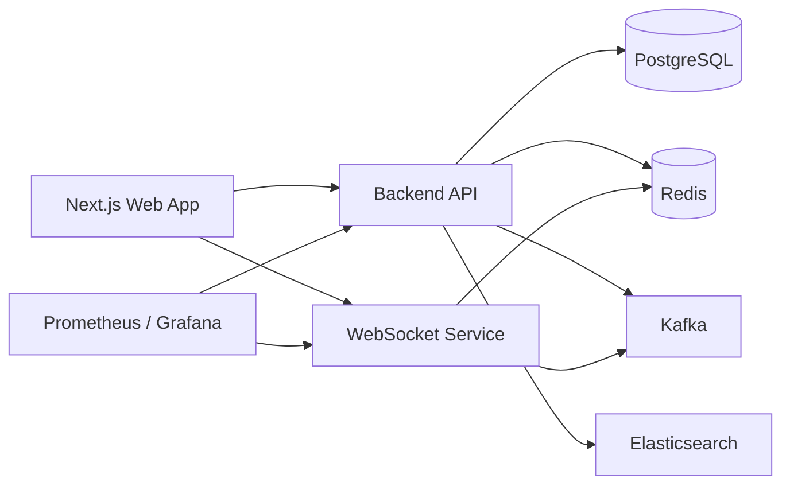

# Modheshwari

<Callout type="info">
**Type:** Self-initiated personal project — built for the Modheshwari community. **Live at** [modheshwari.nerdev.in](https://modheshwari.nerdev.in/)
</Callout>

## Problem / Context

Modheshwari was built to solve a practical coordination problem for a community organization: how to manage families, governance roles, events, approvals, communications, and member discovery without relying on scattered spreadsheets, group chats, and manual follow-ups.

The platform is designed for a community of **10,000-15,000 members** and needed to support a mix of high-trust administrative workflows and day-to-day member interaction. In practice, that meant a system that could:

- model community hierarchy and role-based permissions
- support event approvals and registrations
- handle resource requests with multi-step review
- deliver notifications and chat in near real time
- remain operational in a self-hosted or small-team deployment environment

The project was never just a CRUD app. It was a distributed product with business rules, notification delivery, realtime communication, and infrastructure concerns all interwoven.

## My Role

I was responsible for shaping and implementing the core product architecture across the backend, realtime messaging layer, data model, and deployment structure.

My work centered on:

- designing the multi-service architecture for API, websocket, and background processing
- implementing the domain model and workflows for families, events, approvals, and notifications
- building authentication and role-based authorization for different community roles
- integrating asynchronous notification delivery with Kafka and Redis
- setting up containerized deployment, observability, and operational tooling

This was a full-stack implementation with strong backend and platform responsibilities rather than a UI-only exercise.

## Architecture Overview

**Architecture at a glance:**

The Next.js web app talks to two backend services: a Bun-based REST API and a dedicated WebSocket service. The API reads and writes to PostgreSQL (via Prisma) and Redis, and publishes events to Kafka for async processing. The WebSocket service consumes from Redis and Kafka to push realtime updates to connected clients. Search runs through Elasticsearch, and Prometheus/Grafana monitor both the API and WebSocket service.

The system is organized as a monorepo with three runtime services:

- a Bun-based backend API serving business logic and REST endpoints
- a dedicated WebSocket service for realtime chat and notification delivery
- a shared Prisma-backed data layer for persistence and schema evolution

## Hard Technical Challenges Solved

### 1. Building a notification system that could scale without coupling delivery to the main request path

One of the more interesting technical problems was making notifications reliable and fast without blocking the core API experience. The product needed to support role-based broadcasts, event-driven approvals, and user-facing delivery without making the request path fragile.

The solution used Kafka as an event backbone and Redis as a fast intermediary for in-app delivery previews and realtime fanout. That allowed the API to publish an event and return quickly while downstream workers and websocket consumers handled delivery asynchronously.

This work involved:

- publishing notification events from the backend
- routing them through Kafka topics
- consuming and pushing updates to connected clients
- handling persistence, retry, and dead-letter patterns for delivery resilience

That design made the notification pipeline far more resilient than a naive synchronous approach.

### 2. Implementing multi-step approvals for community workflows

Community workflows are not simple CRUD operations. Approvals are stateful, role-sensitive, and need to be evaluated across multiple actors. For events and resource requests, the system had to support:

- creation in a pending state
- approval records for multiple reviewers
- role-based permissions
- final state transitions based on collective decisions
- user notification when the workflow completed

This required carefully modeling the approval lifecycle in Prisma, coordinating updates across related tables, and making sure the overall workflow state remained consistent even as different actors reviewed it. The implementation shows the shift from simple API endpoints to stateful domain workflows.

### 3. Making realtime communication work in a multi-service deployment

Realtime chat and notification delivery had to work independently of the main HTTP API. The websocket layer had to authenticate clients, manage connection state, route messages, and integrate with the same notification pipeline as the REST API.

The implementation needed to keep socket sessions lightweight while ensuring that:

- users received chat and typing updates correctly
- read receipts were processed efficiently
- notification previews could be delivered immediately
- the service could reconnect gracefully and continue operating even when some downstream dependencies were unavailable

That was a meaningful systems problem because it required bridging HTTP, WebSocket, Redis, Kafka, and the database in a cohesive operational model.

## Tech Stack

- TypeScript
- Bun
- Next.js 15
- React 19
- Tailwind CSS
- Elysia
- Prisma ORM
- PostgreSQL
- Redis
- Kafka
- WebSocket service
- Docker Compose
- GitHub Actions
- Prometheus / Grafana
- Terraform

## Current State

The project is live and in a portfolio-ready state. The repository includes:

- a working multi-service architecture (API, WebSocket service, background workers)
- a substantial Prisma domain model spanning families, events, approvals, and notifications
- role-based CRUD and approval workflow logic
- realtime notification/chat capability
- deployment and monitoring configuration
- CI/CD automation and infrastructure definitions

It's a production-minded system with real architectural depth and operational concerns — the kind of project that holds up under the questions interviewers actually ask when they want to understand how someone thinks about systems, not just features. As with any actively maintained platform, some areas (test coverage, distributed rate limiting) are still evolving.

## What I Built

- Architected a full-stack community management platform designed to support 10,000-15,000 members, covering family records, events, resource requests, forums, and notifications.
- Designed role-based access control with privacy controls across community, gotra, family, and member roles.
- Built multi-approver resource request and event approval workflows using Prisma/PostgreSQL as the domain model.
- Implemented asynchronous notification delivery via Kafka workers and a dedicated WebSocket service for real-time messaging and updates.
- Set up CI/CD with GitHub Actions to build, test, and deploy Docker images to AWS ECR/ECS, with Prometheus and New Relic monitoring.
- Load/stress-tested the platform against projected usage for a 10-15k member community.

## What This Project Demonstrates

This case study highlights the kinds of engineering decisions that matter in interviews:

- service boundaries and modularity
- asynchronous systems design
- stateful workflow modeling
- realtime architecture
- deployment and observability
- practical tradeoffs in a real product codebase

---

**Links:**
- [Live Platform](https://modheshwari.nerdev.in/)
- [GitHub Repository](https://github.com/nerdev-co/modheshwari)

**Tech Stack:** Bun, TypeScript, Next.js, React, Prisma, PostgreSQL, Redis, Kafka, WebSockets, Docker, GitHub Actions, Terraform, Prometheus
