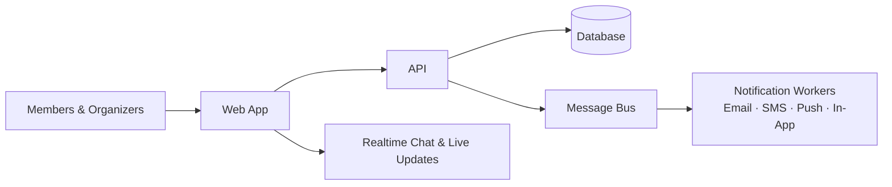
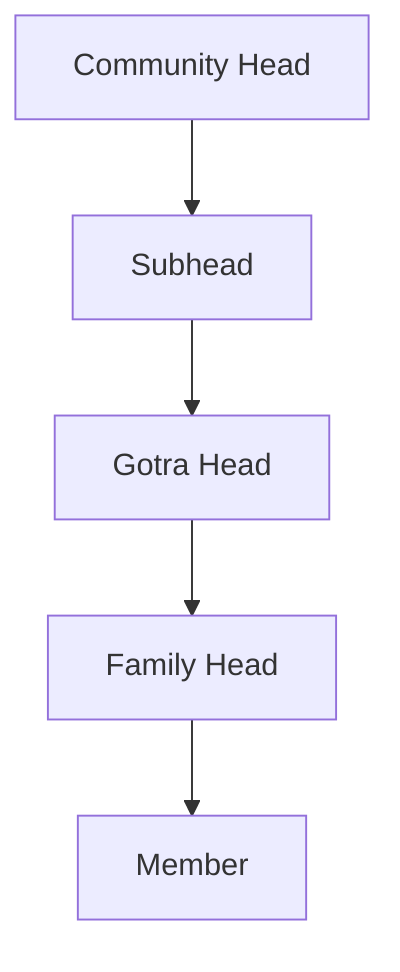

# Modheshwari

<Callout type="info">
**Type:** Self-initiated personal project to built for the Modheshwari community. **Live at** [modheshwari.nerdev.in](https://modheshwari.nerdev.in/) · **Source** [github.com/NalinDalal/modheshwari](https://github.com/NalinDalal/modheshwari)
</Callout>

## The Problem

A community of **10,000-15,000 members** was being run on spreadsheets, group chats, and manual follow-ups. Family records, event registrations, approvals, and announcements lived in tools that didn't talk to each other to so organizers spent their time chasing information and pinging people instead of serving the community.

The goal: one platform where the right people see the right things at the right time, specifically:

- members can find families and know who's who in the community
- events, resource requests, and status updates move through proper approval workflows
- nobody misses an important notification, and nobody gets spammed
- organizers can run the whole thing without a dedicated IT team

## My Role

### End-to-end product architecture and implementation

Designed and built the product end-to-end as a solo engineer, owning the architecture, backend, realtime infrastructure, data model, asynchronous workflows, and deployment.

The system was structured as a distributed, event-driven application spanning:

* **Core architecture:** designed the multi-service platform across API, WebSockets/realtime communication, background workers, and persistence.
* **Domain & workflows:** modeled and implemented the core workflows for families, events, approvals, roles, and notifications, including the state transitions and business rules connecting them.
* **Identity & authorization:** built authentication and role-based access control around the different community roles and their permissions.
* **Realtime & asynchronous systems:** implemented realtime messaging alongside Kafka/Redis-based event and notification processing, with the reliability mechanisms required to make asynchronous delivery safe.
* **Reliability & consistency:** introduced a transactional outbox, idempotent consumers, reconnect reconciliation, and audit logging to handle failures, retries, duplicate events, and inconsistent client state.
* **Production infrastructure:** containerized the services and established deployment, observability, logging, and operational tooling.

This wasn't simply a full-stack application with a backend attached. It involved designing and operating the underlying architecture needed to make a **realtime, role-aware, event-driven product reliable in production**: with full ownership from domain modeling through infrastructure and deployment.

## What It Does

A members-first community platform:

- **Family directory & discovery**: searchable profiles, family trees, and member relations with privacy controls per role.
- **Events**: create, submit for approval, register, and pay, with organizers notified as decisions happen.
- **Resource requests**: multi-step approvals (e.g. hall bookings) that move up the chain automatically.
- **Health & status tracking**: per-member medical records and status updates, with an approval workflow for sensitive changes.
- **Realtime chat**: direct messaging with typing indicators, read receipts, and no lost messages.
- **Notifications on your terms**: in-app, email, SMS, and push, escalating to a stronger channel only if you haven't read the message.

## Making It Dependable

Building the features was the easy part. The hard part was making them **keep working** when a process crashes, a phone is offline, or a broadcast goes out to 5,000 people at once.

### Messages that never silently disappear

If a notification is saved to the database and the system crashes before the worker picks it up, the message is gone to and with 4 channels and thousands of members, "gone" means someone misses a funeral, a vaccination drive, or an approval deadline. A **transactional outbox** solves this: the message and the business change are written together in a single transaction, so a crash can never split them. Delivery is retried with backoff, and anything still failing lands in a dead-letter queue where it can be inspected instead of lost.

### Notifications that respect your attention (and the budget)

Blasting every message to every channel is expensive to SMS costs real money, and most people read in-app notifications within 5 minutes anyway. So the platform **escalates** instead: start with a gentle in-app notification, and only escalate to SMS (10 minutes) then email (40 minutes) if the member still hasn't read it. Members read what matters, organizers save spend, and nothing urgent slips.

### Realtime chat that survives bad networks

Chat messages are saved **before** they're delivered, so a dropped connection never loses them. When members reconnect, they automatically catch up: pending notifications come back immediately, and missed chat messages sync with pagination and de-duplication. Reconnecting isn't a gamble to it's a resume.

### Roles that match how the community actually runs

Five levels to Member, Family Head, Gotra Head, Subhead, and Community Head to with approvals flowing upward and every role change written to an immutable audit log. Organizers can delegate without losing oversight, and sensitive changes are traceable.

## Operating It, Not Just Shipping It

The platform runs in production on AWS, deployed continuously from GitHub Actions with health checks, automatic rollback, automated database backups to S3, and Prometheus/Grafana monitoring. Four real production incidents (a build disk exhaustion, two Nginx resolution failures, a container crash) were root-caused, fixed at the architectural level, and written up as incident reports to the proper fix, not the symptom patch. The same care went into "it deploys and stays up" as into the features themselves.

## Results

| Metric | Value |
|---|---|
| Community scale | Designed for 10,000-15,000 members |
| Development period | Oct 2025 → present (production since Aug 2026) |
| Notification channels | 4 (in-app, email, SMS, push) |
| Enqueue latency | ~10ms (async delivery) |
| In-app read rate | 70% within 5 minutes |
| Reconnect recovery | Up to 500 missed notifications per reconnect |
| Production stack | AWS EC2 · Nginx · Cloudflare · Docker · CI/CD with auto-rollback |

## Current State

The platform is live with real workflows, a reliable event-driven core, and operating tooling to the kind of project that survives contact with production. Ongoing work: test coverage, an outbox replay UI, and a notification-preferences page.

---

**Links:**
- [Live Platform](https://modheshwari.nerdev.in/)
- [GitHub Repository](https://github.com/NalinDalal/modheshwari)